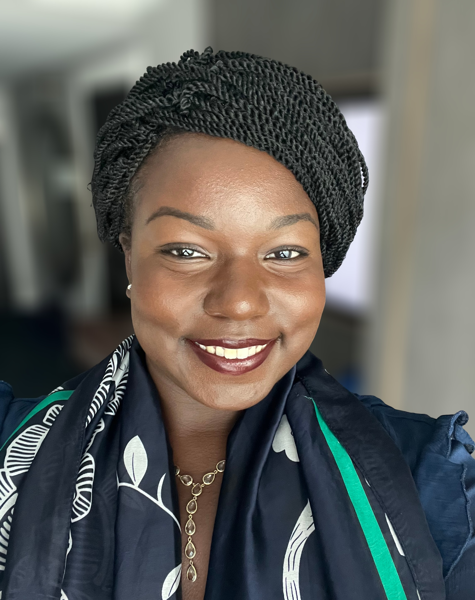

<!-- Main -->

	<!-- Image section -->
        

  

<!-- One -->
<section id="one">
	

		<header class="major">
			<h1>About Me</h1>
		</header>

<!-- Content -->

  <!-- Text section -->
    <h2 style=";">Theresa Alando Oduol</h2>
	  

Theresa Oduol is a research and program management professional with over four years of experience in healthcare systems. She is driven by a passion for advancing health equity and patient safety, with a dedicated focus on closing the gap between available treatments and exceptional care delivery.

Her expertise spans health equity, program management, academic affairs, and quality operations, guided by a strong commitment to detail and independent judgment. With a deep interest in pharmacoequity, Theresa applies this lens across all her research activities and thrives in multidisciplinary settings.

She has contributed to research in pharmacoepidemiology, health services research, and policy, leading innovation projects that evaluate hospital-based inequities and test practical solutions, and has presented her work at multiple international conferences. Her research also includes examining Medicaid data quality, analyzing oncology drug pricing, and improving caregiving documentation in electronic health records.

Theresa’s research philosophy centers on the value of personal narratives in navigating healthcare systems as a way to observe and explore opportunities for improving care delivery. These experiences have been the foundation of her past and current research questions and have cultivated her interest in health services research and policy.

Theresa believes that a meaningful career must also create space for mentorship. She has developed multiple summer internship programs and one-on-one mentoring opportunities for high school and college students—work she considers one of her greatest sources of joy and a driver of her professional purpose. As the Founder of The Alando Exchange (Amplifying Learning And Nurturing Diverse Opportunities), Theresa works with high school juniors and seniors and college students in the U.S. and Kenya, providing guidance in networking, communication strategies, mentor identification, and outreach to help students gain applied experiences that complement their higher education. Learn more about The Alando Exchange on this website.

Theresa is a graduate of Cornell University, where she earned honors with distinction in research. Her interdisciplinary major bridged infectious disease biology with public administration and development coursework to better understand the social, economic, and political drivers of disease. As she enters graduate school, Theresa is committed to synthesizing new knowledge, advancing care delivery strategies to enhance safety, and serving communities.

Outside of her career, Theresa loves to play pickleball and tennis, cook, and foster shared experiences with friends, family, and colleagues.

 

<!-- Buttons -->
<ul class="actions" style="display:flex; justify-content:center; gap:15px; list-style:none; padding:0; margin:20px 0;">
	<li><a href="https://www.linkedin.com/in/theresa-oduol-8babbb192/" class="button special">LinkedIn</a></li>
	<li><a href="https://github.com/taoduol" class="button special">Github</a></li>
	<li><a href="https://pubmed.ncbi.nlm.nih.gov/?term=theresa+oduol&sort=date" class="button special">PubMed</a></li>
	<li><a href="assets/files/TheresaOduol_CV.pdf" class="button icon fa-download" download>CV</a></li>
</ul>

<h4>Experienes</h4>

Having traveled across the globe, I hope to continue shaping my research through the lens of global collaboration and shared experiences.

	

		

		

		

		<!-- Break -->
		

		

		

		<!-- Break -->
		

		

		

	

 
